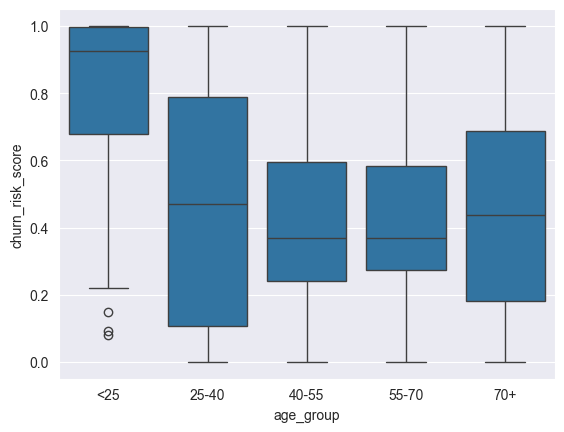
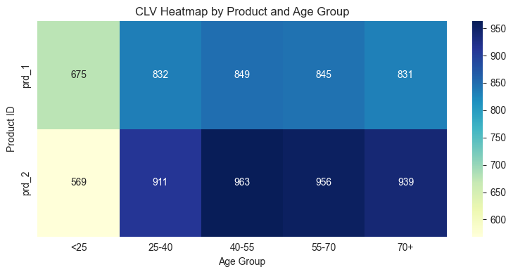
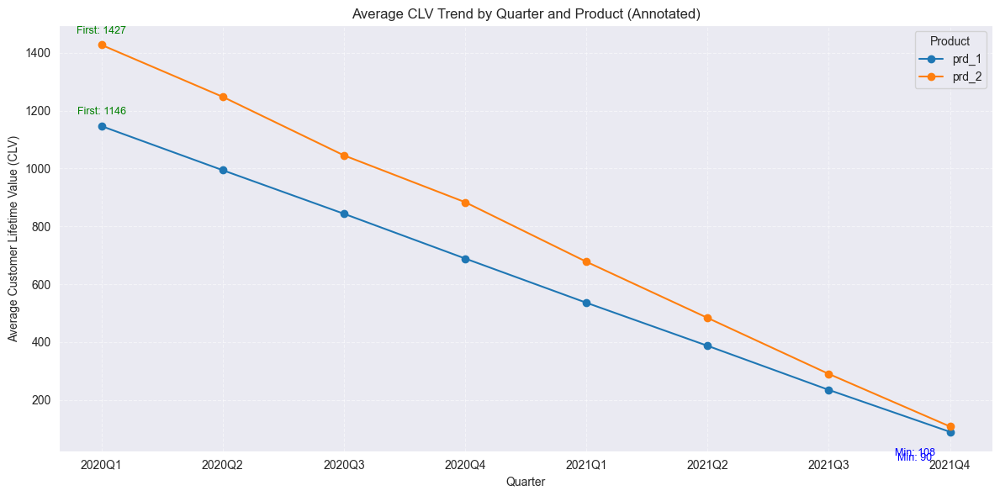

## Machine Learning: Random Forest

### Analysis of churn risk level by age group(Boxplot)

| Age Group |   Median Risk   |   IQR (Q1–Q3)   |     Whiskers & Outliers      |
|:---------:|:---------------:|:---------------:|:----------------------------:|
|   <25     |    Very high    |  Tight, high    | Few very low-risk outliers   |
|  25–40    | Mid (~0.45)     |  Very wide      | Spans almost the full [0–1]  |
|  40–55    | Lower (~0.35)   |  Moderate       | No extreme outliers          |
|  55–70    | Lower (~0.30)   | Moderate-wide   | A few at both extremes       |
|   70+     | Mid (~0.45)     |  Wide           | Some very high churners      |

**Insights**:

1. Under-25s are the most at-risk cohort. Almost everyone here is high‐risk—prioritize retention campaigns.
2. 25–40 and 70+ show the biggest churn‐risk spread, where it needs a further segment, combined with data from other departments. 
3. Middle‐aged groups (40–55, 55–70) are more predictable.

**Strategies**:
- For `<25`: cooperating with marketing data, we need further to analyze the marketing campaigns and design rentention campaigns.  
- For `25–40` & `70+`: design A/B test messaging, marketing drafts two headline/offer variants per cohort, analytics sets up cohort splits, monitors open/click/conversion lift.
- For `40–55` & `55–70`:they are relatively loyal users, review weekly health metrics 
- Re‐evaluate after retraining to see if patterns persist.

### Analysis of  CLV by age and subsciption(Heatmap)

1. Highest CLV Segments
prd_2(monthly) consistently has higher CLV than prd_1(annual) for every age group (due to higher monthly revenue and long average lifetimes).

2. Both products have lowest CLV for the <25 segment (prd_1: 675, prd_2: 569), and these cells appear lighter.

This corresponds to younger customers churn faster(also higher churn rate) and generate less value.

**Key Patterns**:

Age Group Trends:

Both Subscriptions(Annual & Monthly): Older age groups (>25) generally have longer average lifetimes (8+ months) and higher CLV than the youngest group (<25).

<25 group: Shortest lifetime (around 4.5–6.8 months) and lowest CLV, especially for monthly subscription.

Middle Age Groups (25-55): Highest CLV and average lifetime for both subscriptions.

**Insights**:
For stakeholders:

Target 25-70 Age Groups: These segments deliver the highest CLV. Marketing, retention, and upsell efforts here will provide the best ROI. They are a strong base for prd_2 upgrades.

Younger (<25) Segment: This segment is underperforming — shortest lifetime, lowest CLV. Investigate their needs, price sensitivity, or different needs. Consider tailored offerings or student discounts.  

prd_2 Upsell: prd_2 consistently yields higher CLV—if it's a higher tier, there's a clear business case for upselling prd_1 users.

Churn Focus: Investigate why <25 churns quickly—surveys, interviews, or feature analysis could help retain this segment if strategic.

### Analysis of CLV Trend(Line)

CLV is steadily decreasing quarterly for both subscriptions.
prd_2 consistently maintains a higher CLV than prd_1, but both decline rapidly over time.
It is a sign that newer cohorts are less valuable—a red flag for future customer quality, retention, or engagement.

