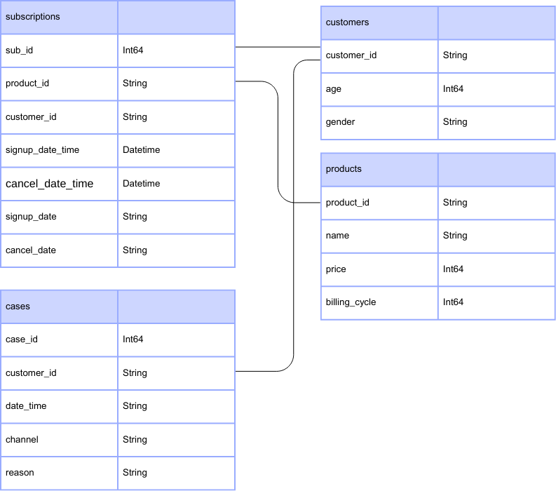

# Project Background

FinAdvisory is a fintech company that provides digital subscription-based investment advisory services to individuals through its monthly and annual plans. Until recently, much of this data had been underutilized in shaping customer retention and revenue strategy.

This project delivers a comprehensive analysis of customer churn and lifetime value (CLV) across subscription types and age cohorts over the 2020–2022 period. By integrating subscription records with demographic insights, the analysis identifies key trends in customer attrition and value contribution, ultimately enabling FinAdvisory to optimize its customer success, marketing, and financial planning strategies.

Insights and recommendations are provided across the following key areas:

- Churn Trends Analysis: Evaluation of churn behavior across monthly and annual subscribers, including changes over time, average customer lifetime, and segment-level churn risk.

- Segment-Level Insights: Analysis of churn performance by age group, highlighting high-risk and high-value customer segments.

- Customer Lifetime Value (CLV) Forecasting: Estimation of CLV by age and plan type, identifying which segments drive the most revenue and which are most at risk of early churn.

An interactive Tableau dashboard can be downloaded here. 

# Data Structure & Initial Checks

FinAdvisory's data structure as seen below consists of four tables: subscriptions, cases, customers and products with 310,064 records.   

  

# Executive Summary

#### Key Insigts

High-risk cohorts: e.g. monthly subscribers aged 18–25 churn at 45% vs. 22% overall

High-value at risk: 35–44-year-olds on annual plans have the highest CLV yet moderate churn risk

Revenue drivers: a 5% reduction in monthly churn yields a $XM lift in 2022

Staffing hotspots: peak call volume between 10 AM–12 PM on weekdays

#### Strategic Recommendations To Stakeholders

1. Marketing & Growth
- Tailored campaigns for “high-CLV/high-risk” cohorts (e.g. exclusive webinars)
- Referral bonuses for low-risk/high-CLV segments

2. Product & Customer Success
- Feature prioritization: invest in in-app guidance where churn spikes
- Proactive outreach: automated check-ins for cohorts at 80% probability of churn

3 Finance & Operations
- Pricing experiments: test annual discounts vs. monthly promotions to optimize CLV
- Staffing plan: align care-team headcount with forecasted case-volume heatmap

#### Limitations & Next Steps
- Data gaps: e.g. no in-product usage logs
- Model refinements: incorporate NLP on case topics
- Extended analyses: lifetime value by channel-of-acquisition

