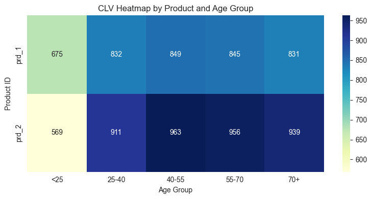
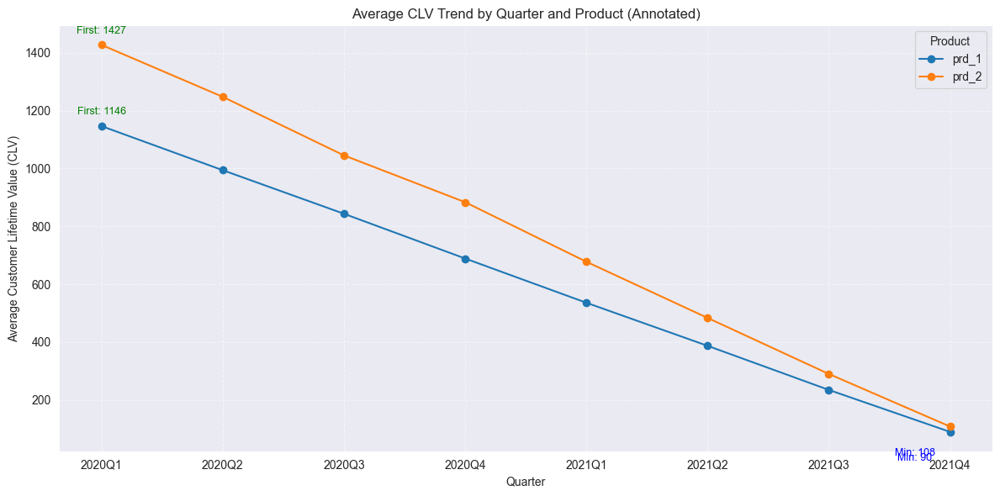
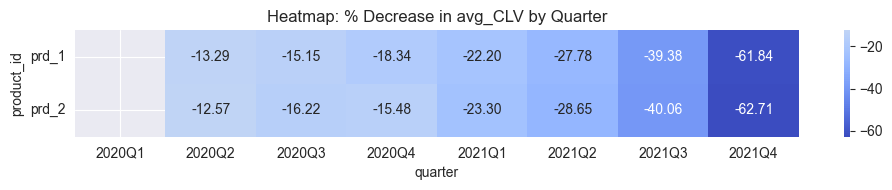

# Project Background

FinAdvisory is a fintech company that provides digital subscription-based investment advisory services to individuals through its monthly and annual plans. Until recently, much of this data had been underutilized in shaping customer retention and revenue strategy.

This project delivers a comprehensive analysis of customer churn and customer lifetime value (CLV) across subscription types and age cohorts over the 2020–2022 period. By integrating subscription records with demographic insights, the analysis identifies key trends in customer attrition and value contribution, ultimately enabling FinAdvisory to optimize its customer success, marketing, and financial planning strategies.

Insights and recommendations are provided across the following key areas:

- Churn Trends Analysis: Evaluation of churn behavior across monthly and annual subscribers, including changes over time, average customer lifetime, and segment-level churn risk.

- Segment-Level Insights: Analysis of churn performance by age group, highlighting high-risk and high-value customer segments.

- Customer Lifetime Value (CLV) Forecasting: Estimation of CLV by age and plan type, identifying which segments drive the most revenue and which are most at risk of early churn.

An interactive Tableau dashboard can be downloaded here. 

# Data Structure & Initial Checks

FinAdvisory's data structure as seen below consists of four tables: subscriptions, cases, customers and products with 310,064 records.   

  

# Executive Summary

#### Key Insigts

High-risk cohorts: e.g. monthly subscribers aged 18–25 churn at 45% vs. 22% overall

High-value at risk: 35–44-year-olds on annual plans have the highest CLV yet moderate churn risk

Staffing hotspots: peak call volume between 10 AM–12 PM on weekdays

#### Churn risk level by age group(Boxplot)

| Age Group |   Median Risk   |   IQR (Q1–Q3)   |     Whiskers & Outliers      |
|:---------:|:---------------:|:---------------:|:----------------------------:|
|   <25     |    Very high    |  Tight, high    | Few very low-risk outliers   |
|  25–40    | Mid (~0.45)     |  Very wide      | Spans almost the full [0–1]  |
|  40–55    | Lower (~0.35)   |  Moderate       | No extreme outliers          |
|  55–70    | Lower (~0.30)   | Moderate-wide   | A few at both extremes       |
|   70+     | Mid (~0.45)     |  Wide           | Some very high churners      |

1. Under-25s are the most at-risk cohort. Almost everyone here is high‐risk—prioritize retention campaigns.
2. 25–40 and 70+ show the biggest churn‐risk spread, where it needs a further segment, combined with data from other departments. 
3. Middle‐aged groups (40–55, 55–70) are more predictable.

**Strategies**:
- For `<25`: cooperating with marketing data, we need further to analyze the marketing campaigns and design rentention campaigns.  
- For `25–40` & `70+`: design A/B test messaging, marketing drafts two headline/offer variants per cohort, analytics sets up cohort splits, monitors open/click/conversion lift.
- For `40–55` & `55–70`:they are relatively loyal users, review weekly health metrics 
- Re‐evaluate after retraining to see if patterns persist.

#### CLV by age and subsciption(Heatmap)

1. Highest CLV Segments
prd_2(monthly) consistently has higher CLV than prd_1(annual) for every age group (due to higher monthly revenue and long average lifetimes).

2. Both products have lowest CLV for the <25 segment (prd_1: 675, prd_2: 569), and these cells appear lighter.

This corresponds to younger customers churn faster(also higher churn rate) and generate less value.

Age Group Trends:

Both Subscriptions(Annual & Monthly): Older age groups (>25) generally have longer average lifetimes (8+ months) and higher CLV than the youngest group (<25).

<25 group: Shortest lifetime (around 4.5–6.8 months) and lowest CLV, especially for monthly subscription.

Middle Age Groups (25-55): Highest CLV and average lifetime for both subscriptions.

**Insights**:
For stakeholders:

Target 25-70 Age Groups: These segments deliver the highest CLV. Marketing, retention, and upsell efforts here will provide the best ROI. They are a strong base for prd_2 upgrades.

Younger (<25) Segment: This segment is underperforming — shortest lifetime, lowest CLV. Investigate their needs, price sensitivity, or different needs. Consider tailored offerings or student discounts.  

prd_2 Upsell: prd_2 consistently yields higher CLV—if it's a higher tier, there's a clear business case for upselling prd_1 users.

Churn Focus: Investigate why <25 churns quickly—surveys, interviews, or feature analysis could help retain this segment if strategic.

#### CLV Trend(Line)

CLV is steadily decreasing quarterly for both subscriptions.
prd_2 consistently maintains a higher CLV than prd_1, but both decline rapidly over time.
It is a sign that newer cohorts are less valuable—a red flag for future customer quality, retention, or engagement.

#### Strategic Recommendations To Stakeholders

1. Marketing & Growth
- Tailored campaigns for “high-CLV/high-risk” cohorts (e.g. exclusive webinars)
- Referral bonuses for low-risk/high-CLV segments

2. Product & Customer Success
- Feature prioritization: invest in in-app guidance where churn spikes
- Proactive outreach: automated check-ins for cohorts at 80% probability of churn

3 Finance & Operations
- Pricing experiments: test annual discounts vs. monthly promotions to optimize CLV
- Staffing plan: align care-team headcount with forecasted case-volume heatmap

#### Limitations & Next Steps
- Data gaps: e.g. no in-product usage logs
- Model refinements: incorporate NLP on case topics
- Extended analyses: lifetime value by channel-of-acquisition

